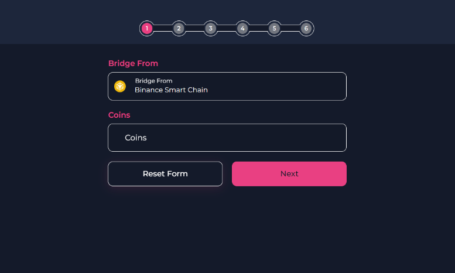
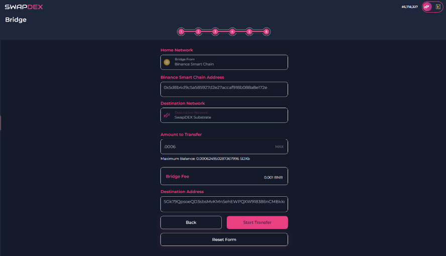

## Prerequisites Before Bridging 📋

Before you start using the SwapDEX Bridge, it's essential to have your wallets set up and ready for transactions. 

### Wallet Setup Guide 🛠️

1. **Create Wallets**: If you don’t have them already, create wallets on the networks you want to bridge assets between (Ethereum, Binance Smart Chain, etc.).

2. **Fund Wallets**: Ensure that your wallets have enough funds not only in the assets you want to bridge but also in the native cryptocurrency (e.g., ETH for Ethereum, BNB for Binance Smart Chain) to cover transaction fees.

3. **Fund SwapDEX Wallet for Gas Fees**: You will need some funds in your SwapDEX wallet to pay for the gas fees. If you don't have funds, you can request them from the faucet bot by joining the SwapDEX Discord server. [Join Discord](https://discord.swapdex.network) and look for the faucet bot to request funds.

4. **Connect Wallets to SwapDEX**: Connect your wallets to the SwapDEX platform. Make sure that you are connecting the correct wallet to the corresponding network.

5. **Security**: Double-check the security of your wallets. Keep your private keys and seed phrases safe.

Please follow our detailed [Wallet Setup Guide](../wallets/index.md) to ensure your wallets are properly configured.

Once your wallets are set up, you are ready to use the SwapDEX Bridge!

# Bridging With SwapDEX

1.  On the left side menu of the SwapDEX Dashboard, select **“Bridge”**.

2.  Select the chain that you would like to bridge from.

    - **Example**: If you would like to bridge SDXb from the Binance Smart Chain to our SwapDEX chain, then here you will select Binance Smart Chain from the list.
    - **Note**: Also make sure your wallet is connected to BSC or the chain which you are bridging from.

      
   

3.  After you have selected the chain you want to bridge from, you can then choose the asset that you would like to bridge over to the SwapDEX Chain.

 

      
    

4.  You will then be prompted to connect your EVM. You can either choose **“Select EVM address”** to automatically import it or you can ‘copy and paste’ your address in the box provided. Then select **“Next”**.

5.  You will now be able to choose what network of ours you want to bridge to, EVM or Substrate. Select **“Next”**.

    - **Hint**: To use our Dex’s or our marketplace, we would suggest you choose Substrate. You can bridge between our Substrate and our EVM later if you want.
    - **Note**: Depending on what you are bridging and where you are bridging to, the steps might be slightly different, but they will still be easy to follow and will still be very similar to this walkthrough.

6.  If you have chosen Substrate, then you will be asked to connect to your substrate address. Select **“Connect To Substrate Account”** under destination address. A new menu will appear underneath with a list of your Substrate accounts.

7.  Select the substrate account that you would like to bridge your assets to. Select **“Next”**.

 

      
    

8.  You will then be asked to choose the amount of that asset you would like to bridge. Enter the amount you want to bridge and select **“Next”**.

9.  The SwapDEX bridge will automatically calculate the gas to bridge your asset and then you will see the final page. Here select **“Start Transfer”**.

 

      
    

10. You will be prompted with a warning. Once you have read the warning, select either **Cancel** or **Confirm**.

    - **Note**: If you are using our native desktop or mobile apps, the transfer will be automatic. If you are using our web app, you will need to sign 2 signatures. They will automatically pop up. Do not close your browser window until the transfer is successful.

11. Your new balance will be available to be viewed in your wallet under **“wallets”** in the left side menu of the SwapDEX Dashboard.
