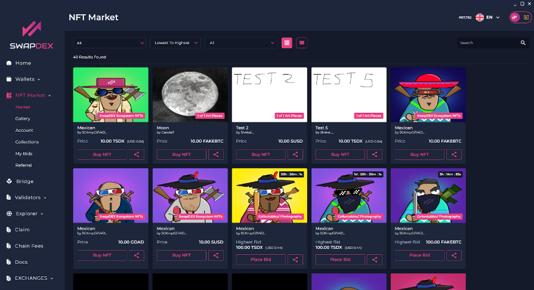

# Buying NFT's

1. Expand the **SwapDEX NFT marketplace** on the left side menu of the App.

2. Select **"Market"** and it will populate the current NFTs that are for sale or auction.

    

3. To bid, select **"Place Bid"** then choose the wallet you want to pay the bidding transaction fees from, as well as the location that you want to receive the NFT. Enter your referral address here if you have one.

    

4. If an NFT is up for sale (not for auction), you can immediately buy it by choosing **"Buy NFT"**.

5. If you win an auction, you can claim it by going back to **"account"** and selecting the downward arrow on the far right of the collection that you were bidding on. Then select the 'pencil symbol" on the right and select **"claim"**.

