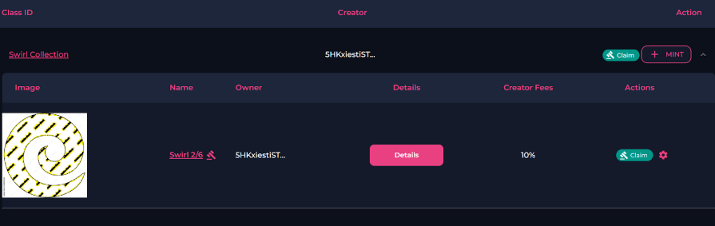
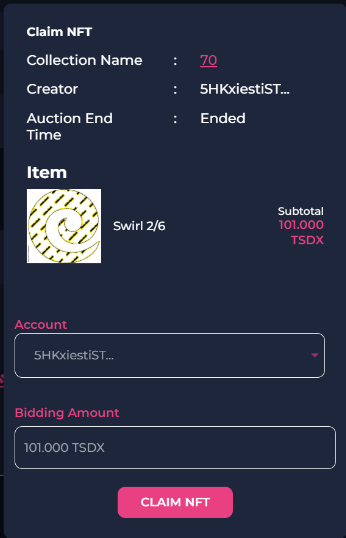

# Winning An NFT Auctions

1. If you win an auction, go to your **"account"** tab in the left menu.

2. Select the downward arrow on the far right of the collection that you were bidding on.

3. Select the green **“Claim"** button on the right of the screen.

    
    

4. A new window will pop up with the NFT’s details. Select **“claim NFT”** when prompted.

 

      
    

5. The NFT will now be in your wallet.
