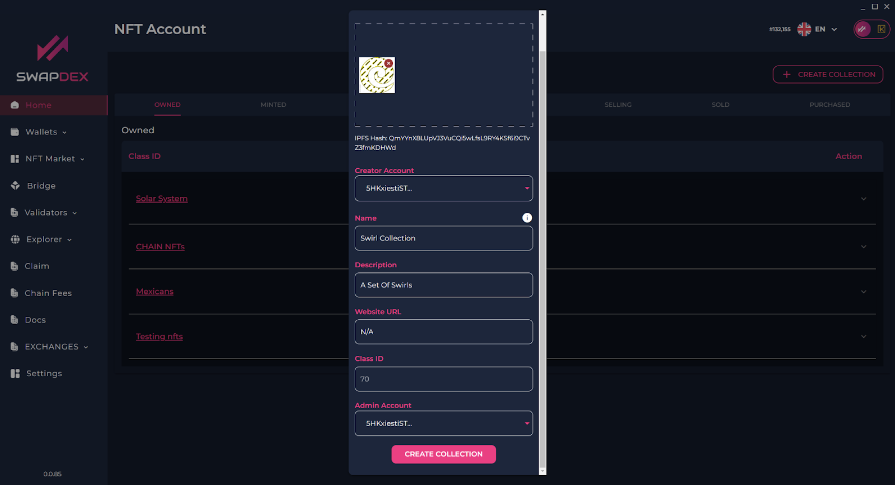
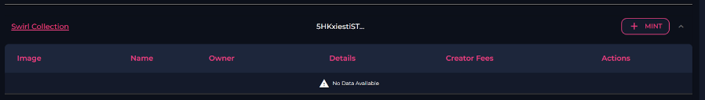
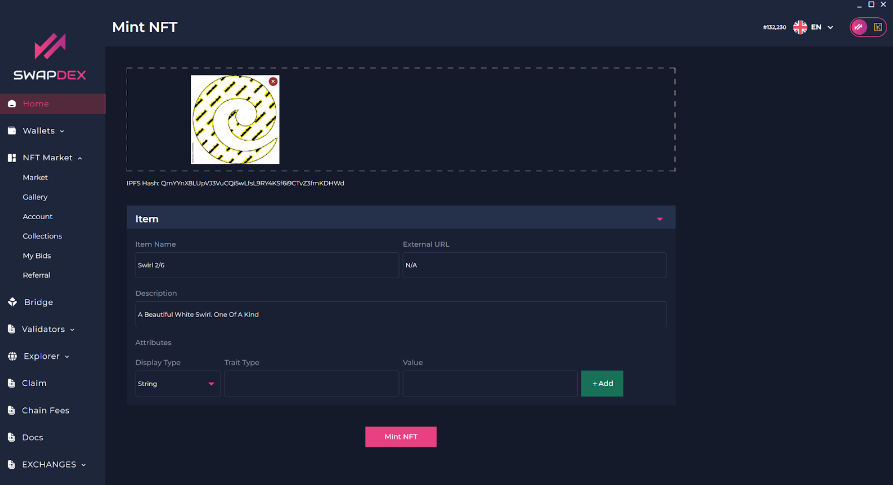
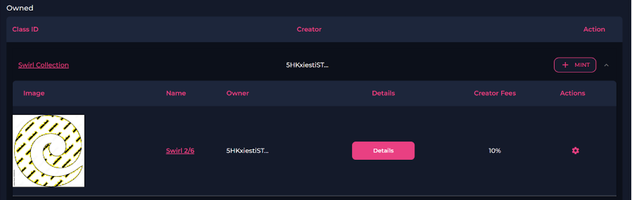
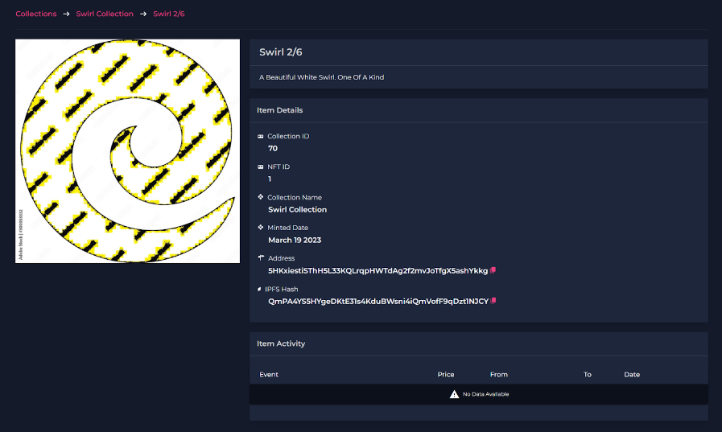

# Minting NFT's

1. Expand the SwapDEX NFT marketplace on the left side menu of the SwapDEX Dashboard App.

2. Select **"Account"** and it will populate a list of your current NFT collections.

3. To mint a new NFT you will first need to select **"create collection"**.

    > **HINT**: For now select the same account for both creator and admin.

    

4. Fill in the details and choose an image you would like related to the collection. You can either browse your computer or you can ‘drag and drop’ an image.

5. Once you have created an account, you will see the account in your **"account’s"** tab (where you created your **"Collection"**).

      
    

6. To mint a new NFT for this collection select **"Mint"**.

7. Here you can either 'drag and drop' your chosen NFT into the box up top or you can select **"browse file"** to find your chosen image on your computer.

8. Once you have selected the file, you then enter the details for your new NFT (name, description, etc.).

    > **Note**: If you don't have an external URL you can enter N/A instead. You can also ignore the attributes as they are for gaming NFT’s.

    

9. Once complete you then select **"Mint NFT"** at the bottom.

10. To view your NFT, go back to the account tab. Open your collection by selecting the down-pointing arrow on the far right.

      
    

11. Select the name of the NFT you want to view, and a new page will open with a photo and description of your new NFT.

      
    
