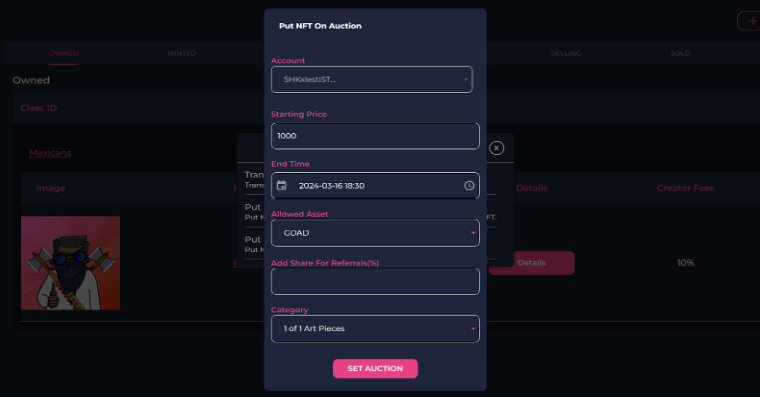
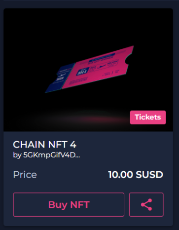
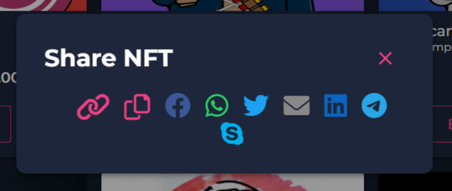

# Our Referral And Commission System

## Seller

### Setting Your Commission

- If you want to incentivize referrals by giving a commission to someone for selling your NFT, you can do this by setting the **“Add Share For Referrals (%)”** when selling your NFT.

 

      
    

- For a walkthrough on how to sell an NFT, you can go to our selling NFTs walkthrough page [here](#).

## Referrer

### Setting Up Your Referral Wallet

1. Expand the SwapDEX NFT marketplace, on the left side menu of the SwapDEX Dashboard App and select **“Referrals”**.

2. Choose the wallet you want to register for referrals and select **“register for referrals”**.

3. Choose the percentage you would like to give as a cashback to your buyer as an incentive.

   - Note: The percentage you set is basically a discount of what the seller is giving to you as the referrer to your customers. So, if a seller has a 20% referral percentage, you would set your wallet's referral percentage at 50% to split the commission and give 10% off as cashback when the buyer purchases an NFT through your link.

      
    

4. Select **“Register”**.

### Advertising Your Referred NFT

- When in the NFT marketplace, there will be an option to **‘share’** an NFT. This is located to the left of **“Buy NFT”**.

      
    

- When selected, you will be prompted with multiple options.

      
    

- Select the option you would like to use to create a shareable link that will automatically reference your wallet ID, then share wherever you would like to advertise, your own site, Facebook, a blog, and so on.

### Claiming Your Referral Rewards

1. Expand the SwapDEX NFT marketplace, on the left side menu of the SwapDEX Dashboard App and select **“Referrals”**.

2. On the right, there will be an option to claim your referrals.
