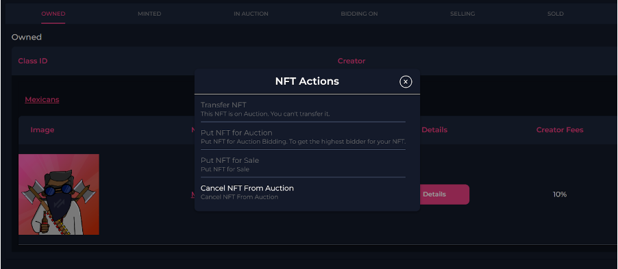

# Canceling An Auction

1. Go back to **"Account"** and it will populate a list of your current NFT collections.

2. Select the 'gear symbol' again. You will now have the option to cancel your auction or sale.

    > **Note**: However, if your auction already has a bid you cannot cancel.
 
 

      
    
