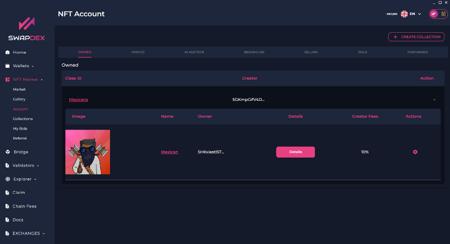

# Selling NFT's

1. Go to the **"account"** tab under **"NFT marketplace"** in the left menu.

2. Select the downwards arrow on the far right of the collection that you wish to sell an NFT from.

3. Select the 'gear symbol' under **‘actions’** on the right of the NFT that you wish to sell.

      
    

4. Choose the option that you want:
    

        
    

    - If you would like to sell your NFT, choose your price, the asset you would like to sell the NFT for, and select the category that your NFT fits under, and then select **"Sell NFT"**.
    - If you would prefer to put your NFT up for auction instead, choose your price, the asset you would like to sell the NFT for, and the category your NFT fits under. When you select your chosen auction end time, choose a local time, as it uses your local web browser’s time. Also, double check you have the correct date that you wish for your auction to finish. To finish, select **"set auction"**.

      
    

5. To cancel an auction or a sale, go back and select the 'gear symbol' again. You will now have the option to cancel your auction or sale (however, if your auction already has a bid you cannot cancel).

