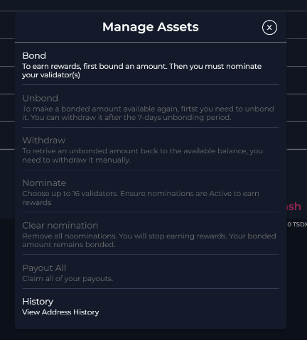
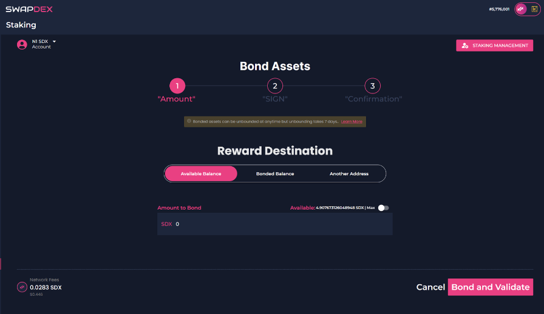
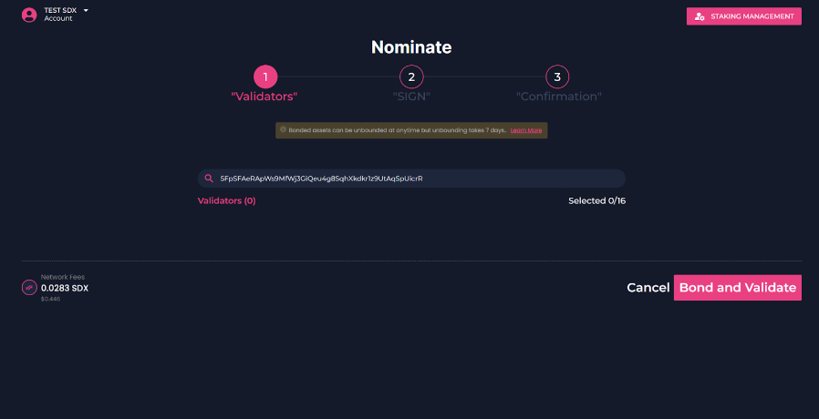

# How To Bond And Nominate Your SDX

1. Go to the **"Validators"** tab in the left menu and select **“Staking”**.

2. On the top left, select the account that holds the SDX tokens that you would like to stake (Substrate accounts only).

3. Next, select **“Staking Management”** on the top right. Here you will have the options to bond, stake, withdraw, etc.

4. Select **“bond”** to get started.
    

      
    

    - Firstly, choose your reward destination. There are 3 options:
        1. Available balance will add your rewards directly to your wallet.
        2. Bonded balance will add your rewards to your bonded amount, therefore, increasing the amount you have bonded (staked).
        3. If you choose another address, your rewards will be sent to an address of your choice.
        

        
        

    - Underneath is your option to bond the amount of SDX that you want to stake on a validator. Once you have chosen how much you want to stake, select **“Bond And Validate”**.

    - You will then be asked to confirm. To confirm, select **“Sign”**.

        

        
        

    > Note: With our native mobile and desktop apps, your wallet signatures will happen automatically, but with our web app, you will need to manually sign the transactions when you get a pop-up. You will be notified on the final step once your transaction is successful. Return to the staking page.

5. Now you have selected the wallet you want to bond from and how much you want to bond, you will now need to select the wallets that you would like to bond your SDX to.

    - You will find the list of the current validators to choose from under **“Overview”** on the left in the staking menu.

    - Choose the validator/s that you would like to bond your SDX tokens to. You can choose up to 16 validators per wallet that you use to stake with.

    > Note: Choose your validators wisely: Part of your bonded assets may be irrevocably lost if the validator does not behave appropriately.

    - First, make sure you have your chosen wallet selected on the top left, it may revert back to the first wallet in the list if you have more than one.

    - Now go back to **“Staking Management”** on the top right and select **“Nominate”**.
    

    
    

6. Once you have read the page and are happy to bond your tokens, select **“Continue”**.

7. Now choose the validators that you wish to nominate your SDX tokens to.
    

    
    

## Clearing Your Nominations

- If you wish to clear your nominations, you do so by selecting the account that you would like to clear your nominations from and select **“Clear Nominations”**.
