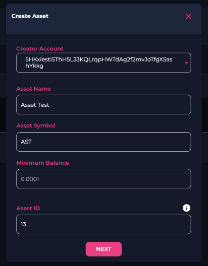
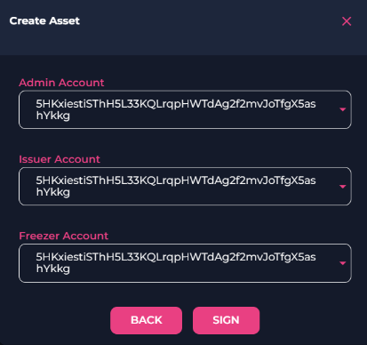
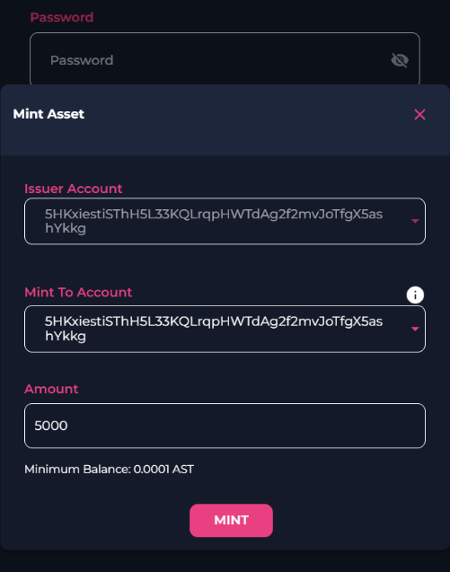

# How To Create An Asset 🪙

Follow these steps to create your own asset on the SwapDEX Dashboard App:

1. **Access Wallets Tab**: Expand your wallets tab on the left side menu of the SwapDEX Dashboard App.

2. **Select Assets**: Select "Assets" and it will populate a list of your current NFT collections.

3. **Create Asset**: On the top right, select “Create”.

4. **Configure Asset**: Choose the account to which you would like your asset minted. Then choose the name and abbreviation that you would like for your asset (the recommended abbreviation is 3 letters, all capitals). Minimum balance is already set and there should be no reason to change your asset ID. Select “Next”.

  

5. **Set Accounts**: You will be prompted for 3 accounts: Admin, Issuer, and Freezer accounts. Unless you have a specific reason to change them, it is recommended that you keep them all the same account.

  

6. **Sign Transaction**: Sign your transaction. Note: With our native mobile and desktop apps, your wallet signatures will happen automatically as the EVM and Substrate wallet are inbuilt, but with our web app, you will need to manually sign the transactions. You will get an extra pop-up that you will need to sign from Substrate.js.

7. **Mint Asset**: Once you have created your asset, you will find it under assets in your wallets tab. From here you can mint and send your assets. To mint some of your asset, you will need to select “Mint” on the far right of your asset. Choose the account that you would like to mint to and the amount that you would like to mint. To mint, select “Mint”.

  

8. **Transfer Asset**: You now have minted some of your asset. To send your asset, select “Transfer”. You will find the Transfer function next to the Mint function that you just used. Enter the address that you would like to send your asset to and the amount you would like to send and select “Make Transfer”.

  

9. **Receive Asset**: For anyone to receive an asset from you, they can also use our “receive” option. 

  

If you would like to receive some of your asset, you can send the Substrate account you would like to receive your assets to the sender. You can also use the “receive” option in the transfer window to use a QR code to receive the asset. Just make sure you have the correct account details for which you would like to receive the asset.

  

You can send and receive any asset you like by following these steps. Happy trading! 🚀
