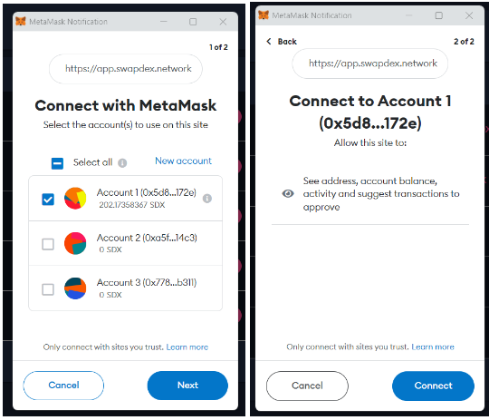

## Web App

To use our web app, you will need to install both the Metamask and Polkadot.js extensions and set up a wallet in each of them. These extensions are not built into our web app like they are in our native apps. Here are the links to download and install them:

- [Metamask Extension](https://metamask.io/download/)
- [Polkadot.js Extension](https://polkadot.js.org/extension/)

Once you have set up your wallets, follow these steps:

1. Open our web app.

2. Expand the Wallets section on the left side menu of the SwapDEX Dashboard and select "Account".

3. Metamask will pop up, prompting you to sign in. Sign in to your Metamask wallet.

4. After signing in, you will be prompted to "Connect with Metamask". Select "Next".

5. You will then be asked if you would like to add the SwapDEX network to Metamask. Select "Accept".

6. Next, you will be asked to connect to our network. Select "Connect".

  

7. Your Polkadot.js extension will automatically add your Substrate accounts to the wallets section, and all of your accounts should now be visible.

  

You can now start bridging assets from other chains to your SwapDEX wallet to start trading on our exchanges or buying NFTs from our marketplace.
